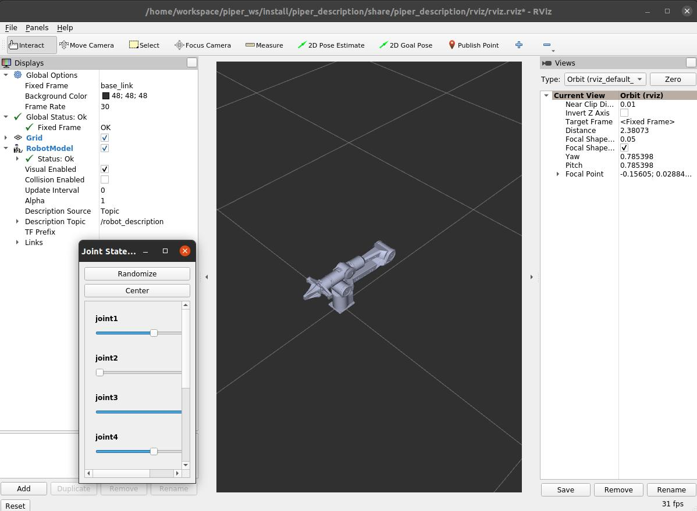

# AgileX Robotic Arm (foxy)

[CN](README.MD)


Test:

|PYTHON |STATE|
|---|---|
|||

## Installation

### Install dependencies

```shell
pip3 install python-can
pip3 install scipy
```

```shell
pip3 install piper_sdk
```

```shell
sudo apt install ros-$ROS_DISTRO-ros2-control
sudo apt install ros-$ROS_DISTRO-ros2-controllers
sudo apt install ros-$ROS_DISTRO-controller-manager
```

## Quick Start

### Enable CAN module

First, you need to set up the shell script parameters.

#### Single robotic arm

##### PC with Only One USB-to-CAN Module Inserted

- **Use the `can_activate.sh` **

Directly run:

```bash
bash can_activate.sh can0 1000000
```

##### PC with Multiple USB-to-CAN Modules Inserted

**Use the `can_activate.sh` **

Disconnect all CAN modules.

Only connect the CAN module linked to the robotic arm to the PC, and then run the script.

```shell
sudo ethtool -i can0 | grep bus
```

and record the `bus-info` value, for example, `1-2:1.0`.

**Note: Generally, the first inserted CAN module defaults to `can0`. If the CAN interface is not found, use `bash find_all_can_port.sh` to check the CAN names corresponding to the USB addresses.**

Assuming the recorded `bus-info` value from the above operation is `1-2:1.0`.

Then execute the command to check if the CAN device has been successfully activated.

```bash
bash can_activate.sh can_piper 1000000 "1-2:1.0"
```

**Note: This means that the CAN device connected to the USB port with hardware encoding `1-2:1.0` is renamed to `can_piper`, set to a baud rate of 1,000,000, and activated.**

Then run`ifconfig` to check if `can_piper` appears. If it does, the CAN module has been successfully configured.

#### Enable multiple CAN modules

**Use the `can_config.sh`  here**

In the `can_config.sh`, the `EXPECTED_CAN_COUNT` shows the number of the CAN modules you want to activate. Assume it's 2 here. 

Then, insert one of the two CAN modules into the PC alone and run the script.

```shell
sudo ethtool -i can0 | grep bus
```

and record the `bus-info` value, for example, `1-2:1.0`.

Next, insert the second CAN module, ensuring it is connected to a different USB port than the one used previously, and then execute the script.

```shell
sudo ethtool -i can1 | grep bus
```

**Note: Generally, the first inserted CAN module defaults to `can0`, and the second one to `can1`. If the CAN interfaces are not found, use `bash find_all_can_port.sh` to check the CAN names corresponding to the USB addresses.**

Assuming the recorded `bus-info` values are `1-2:1.0` and `1-4:1.0`, replace the parameters inside the double quotes in `USB_PORTS["1-9:1.0"]="can_left:1000000"` with `1-2:1.0`.

Similarly, update the other one

`USB_PORTS["1-5:1.0"]="can_right:1000000"` -> `USB_PORTS["1-4:1.0"]="can_right:1000000"`

**Note: This means that the CAN device connected to the USB port with hardware encoding `1-2:1.0` is renamed to `can_left`, set to a baud rate of 1,000,000, and activated.**

Then execute `bash can_config.sh` and check the terminal output to see if the activation was successful.

Afterward, run `ifconfig` to verify if `can_left` and `can_right` appear. If they do, the CAN modules have been successfully configured.

### Start the Node

```shell
colcon build
```

#### Single robotics arm

Node name: `piper_single_ctrl`

param

```shell
can_port: name of the CAN route to open.

auto_enable: Whether to automatically enable the system. If True, the system will automatically enable upon starting the program.
#  Set this to False if you want to manually control the enable state. If the program is interrupted and then restarted, the robotic arm will maintain the state it had during the last run.
# If the arm was enabled, it will remain enabled after restarting.
# If the arm was disabled, it will remain disabled after restarting.

girpper_exist: Whether there is an end gripper. If True, it means there is an end gripper and the gripper control will be turned on.

rviz_ctrl_flag: Whether to use RViz to send joint angle messages. If True, the system will receive joint angle messages sent by rViz.
# Since the joint 7 range in RViz is [0,0.04], but the actual gripper travel is 0.08m, joint 7 values sent by RViz will be multiplied by 2 when controlling the gripper.
```

There are two launch files for starting the single-arm robot: `start_single_piper_rviz.launch.py` and `start_single_piper.launch.py`.

The first one can launch RViz together, allowing you to control the robotic arm by moving the sliders.

Start the control node.

```shell
# start the node
ros2 run piper piper_single_ctrl --ros-args -p can_port:=can0 -p auto_enable:=false -p gripper_exist:=true -p rviz_ctrl_flag:=true
# start the launch
ros2 launch piper start_single_piper.launch.py can_port:=can0 auto_enable:=false gripper_exist:=false rviz_ctrl_flag:=true
# Or,the node can be started with default parameters
ros2 launch piper start_single_piper.launch.py
# You can also use RViz to enable control by adjusting the parameters as described above.
ros2 launch piper start_single_piper_rviz.launch.py
```

`ros2 topic list`

```shell
/arm_status #the status of arm
/enable_flag #Enable flag, sent to the node, send true to enable
/end_pose #end pose feedback
/joint_states #Subscribe to the joint message and send the joint position to this message to control the movement of the robot arm
/joint_states_single #joints feedback
/pos_cmd #end pose control
```

ros2 service list

```shell
/enable_srv #Enable service end
```

Enable robotic arm

```shell
# call service
ros2 service call /enable_srv piper_msgs/srv/Enable enable_request:\ true\ 
# pub topic
ros2 topic pub /enable_flag std_msgs/msg/Bool data:\ true\ 
```

Disable the robotic arm

```shell
# call service
ros2 service call /enable_srv piper_msgs/srv/Enable enable_request:\ false\ 
# pub topic
ros2 topic pub /enable_flag std_msgs/msg/Bool data:\ false\ 
```

Publish joint messages

Note: The robotic arm will lift. Please ensure there are no obstacles within its working range.

The robotic arm will move at 10% of the default speed, and the gripper torque is set to 0.5N. The position is as follows:

```shell
ros2 topic pub /joint_states sensor_msgs/msg/JointState "{header: {stamp: {sec: 0, nanosec: 0}, frame_id: 'piper_single'}, name: ['joint1', 'joint2','joint3','joint4','joint5','joint6','joint7'], position: [0.2,0.2,-0.2,0.3,-0.2,0.5,0.01], velocity: [0,0,0,0,0,0,10], effort: [0,0,0,0,0,0,0.5]}"

```

## Note

- You need to activate the CAN device and set the correct baud rate before you can read messages from or control the robotic arm.

- If the following appears:

  ```shell
  Enable state: False
  <class 'can.exceptions.CanError'> Message NOT sent
  <class 'can.exceptions.CanError'> Message NOT sent
  ```

  This indicates that the robotic arm is not connected to the CAN module. Unplug and re-plug the USB, restart the robotic arm, reactivate the CAN module, and then try restarting the node.

- If automatic enabling is turned on and enabling is not successful within 5 seconds, the program will automatically exit.

### piper Custom Messages

ros package `piper_msgs`

 **Robotic Arm Status Feedback Message**: Corresponds to the feedback message with `id=0x2A1` in the CAN protocol.

`PiperStatusMsg.msg`

```c
uint8 ctrl_mode
/*
0x00 Standby mode  
0x01 CAN command control mode
0x02 Teaching mode
0x03 Ethernet control mode
0x04 wifi control mode
0x05 Remote controller control mode
0x06 Linked teaching mode
0x07 Offline track mode
*/
uint8 arm_status
/*
0x00 Normal
0x01 Emergency stop
0x02 No solution
0x03 Singularity
0x04 Target angle exceeds limit
0x05 Joint communication error
0x06 Joint brake not released
0x07 Robotic arm collision detected
0x08 Overspeed during drag teaching
0x09 Joint status abnormal
0x0A Other abnormality
0x0B Teaching record
0x0C Teaching execution
0x0D Teaching paused
0x0E Main control NTC overheating
0x0F Discharge resistor NTC overheating
*/
uint8 mode_feedback
/*
0x00 MOVE P
0x01 MOVE J
0x02 MOVE L
0x03 MOVE C
*/
uint8 teach_status
/*
0x00 Close
0x01 Start teaching recording (enter drag teaching mode)
0x02 End teaching recording (exit drag teaching mode)
0x03 Execute teaching trajectory (reproduce drag teaching trajectory)
0x04 Pause
0x05 Resume (continue trajectory reproduction)
0x06 Terminate execution
0x07 Move to trajectory starting point
*/
uint8 motion_status
/*
0x00 Reached the specified point
0x01 Not reached the specified point
*/
uint8 trajectory_num
/* 0~255 (Feedback in offline trajectory mode) */
int64 err_code// Error code
bool joint_1_angle_limit// Joint 1 communication error (0: Normal, 1: Error)
bool joint_2_angle_limit// Joint 2 communication error (0: Normal, 1: Error)
bool joint_3_angle_limit// Joint 3 communication error (0: Normal, 1: Error)
bool joint_4_angle_limit// Joint 4 communication error (0: Normal, 1: Error)
bool joint_5_angle_limit// Joint 5 communication error (0: Normal, 1: Error)
bool joint_6_angle_limit// Joint 6 communication error (0: Normal, 1: Error)
bool communication_status_joint_1// Joint 1 angle exceeds limit (0: Normal, 1: Error)
bool communication_status_joint_2// Joint 2 angle exceeds limit (0: Normal, 1: Error)
bool communication_status_joint_3// Joint 3 angle exceeds limit (0: Normal, 1: Error)
bool communication_status_joint_4// Joint 4 angle exceeds limit (0: Normal, 1: Error)
bool communication_status_joint_5// Joint 5 angle exceeds limit (0: Normal, 1: Error)
bool communication_status_joint_6// Joint 6 angle exceeds limit (0: Normal, 1: Error)
```

End-effector pose control: Note that some singularities may be unreachable.

`PosCmd.msg`

```c
float64 x
float64 y
float64 z
float64 roll
float64 pitch
float64 yaw
float64 gripper
int32 mode1
int32 mode2
```

## Simulation

open rviz

```shell
ros2 launch piper_description display_xacro.launch.py
```

After running, the `/joint_states` topic will be published, and you can view it using `ros2 topic echo /joint_states`.

At the same time, two windows will pop up as shown below. The slider values correspond to the values of `/joint_states`, and dragging the sliders will change those values. The model in RViz will also move accordingly.



### gazebo

coming...

## Q&A

1. 

```shell
colcon build
Starting >>> piper   
Starting >>> piper_description
Starting >>> piper_msgs
Finished <<< piper [0.31s]                                                                                                              
--- stderr: piper_description                                                                                            
CMake Error at CMakeLists.txt:5 (find_package):
  By not providing "Findament_cmake.cmake" in CMAKE_MODULE_PATH this project
  has asked CMake to find a package configuration file provided by
  "ament_cmake", but CMake did not find one.

  Could not find a package configuration file provided by "ament_cmake" with
  any of the following names:

    ament_cmakeConfig.cmake
    ament_cmake-config.cmake

  Add the installation prefix of "ament_cmake" to CMAKE_PREFIX_PATH or set
  "ament_cmake_DIR" to a directory containing one of the above files.  If
  "ament_cmake" provides a separate development package or SDK, be sure it
  has been installed.


---
Failed   <<< piper_description [0.45s, exited with code 1]
Aborted  <<< piper_msgs [0.45s]

Summary: 1 package finished [0.55s]
  1 package failed: piper_description
  2 packages aborted: piper_description piper_msgs
  3 packages had stderr output: piper_description piper_msgs
```

```shell
source /opt/ros/foxy/setup.bash
```

2. 

```shell
Starting >>> piper   
Starting >>> piper_description
Starting >>> piper_msgs
Finished <<< piper [0.33s]                                                                                                              
Finished <<< piper_description [0.42s]                                                                                     
--- stderr: piper_description                                                               
CMake Error at CMakeLists.txt:7 (find_package):
  By not providing "Findcontroller_manager.cmake" in CMAKE_MODULE_PATH this
  project has asked CMake to find a package configuration file provided by
  "controller_manager", but CMake did not find one.

  Could not find a package configuration file provided by
  "controller_manager" with any of the following names:

    controller_managerConfig.cmake
    controller_manager-config.cmake

  Add the installation prefix of "controller_manager" to CMAKE_PREFIX_PATH or
  set "controller_manager_DIR" to a directory containing one of the above
  files.  If "controller_manager" provides a separate development package or
  SDK, be sure it has been installed.


---
Failed   <<< piper_description [0.80s, exited with code 1]
Aborted  <<< piper_msgs [3.28s]                               

Summary: 2 packages finished [3.38s]
  1 package aborted: piper_msgs
  1 package had stderr output: piper_description
```

```shell
sudo apt install ros-$ROS_DISTRO-ros2-control
sudo apt install ros-$ROS_DISTRO-ros2-controllers
sudo apt install ros-$ROS_DISTRO-controller-manager
```

3. 

```shell
 "package 'joint_state_publisher_gui' not found
```

```shell
sudo apt install ros-$ROS_DISTRO-joint-state-publisher-gui
```

4. 

```shell
sudo apt install ros-$ROS_DISTRO-robot-state-publisher
```

5. 

```shell
sudo apt install ros-foxy-xacro
```
