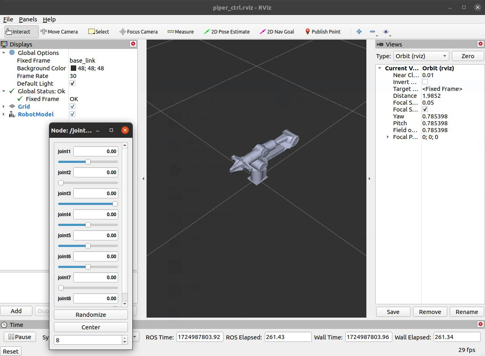
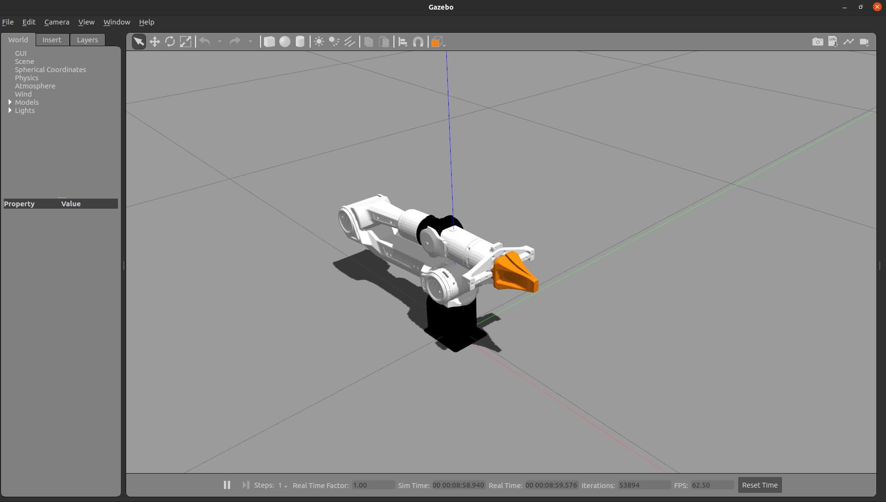
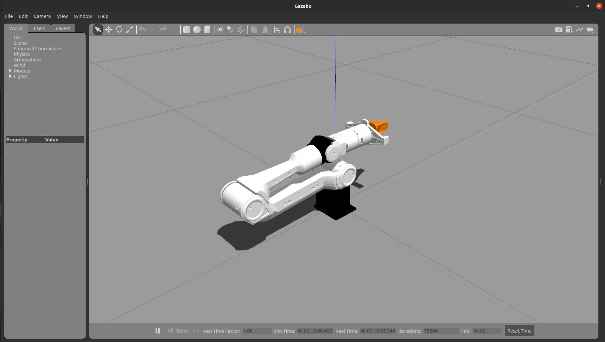

# AgileX Robotic Arm

[CN](README.MD)


|ROS |STATE|
|---|---|
|||

## Installation

### Install dependencies

```shell
pip3 install python-can
```

```shell
pip3 install piper_sdk
```

## Quick Start

### Enable CAN module

First, you need to set up the shell script parameters.

#### Single robotic arm

##### PC with Only One USB-to-CAN Module Inserted

- ##### Use the `can_activate.sh`  

Directly run:

```bash
bash can_activate.sh can0 1000000
```

##### PC with Multiple USB-to-CAN Modules Inserted

- ##### Use the `can_activate.sh`  script

Disconnect all CAN modules.

Only connect the CAN module linked to the robotic arm to the PC, and then run the script.

```shell
sudo ethtool -i can0 | grep bus
```

and record the `bus-info` value, for example, `1-2:1.0`.

**Note: Generally, the first inserted CAN module defaults to `can0`. If the CAN interface is not found, use `bash find_all_can_port.sh` to check the CAN names corresponding to the USB addresses.**

Assuming the recorded `bus-info` value from the above operation is `1-2:1.0`.

Then execute the command to check if the CAN device has been successfully activated.

```bash
bash can_activate.sh can_piper 1000000 "1-2:1.0"
```

**Note: This means that the CAN device connected to the USB port with hardware encoding `1-2:1.0` is renamed to `can_piper`, set to a baud rate of 1,000,000, and activated.**

Then run`ifconfig` to check if `can_piper` appears. If it does, the CAN module has been successfully configured.

### Running the Node

#### Single Robotic Arm

Node name: `piper_ctrl_single_node.py`

param

```shell
can_port:he name of the CAN route to open.
auto_enable: Whether to automatically enable the system. If True, the system will automatically enable upon starting the program.
#  Set this to False if you want to manually control the enable state. If the program is interrupted and then restarted, the robotic arm will maintain the state it had during the last run.
# If the arm was enabled, it will remain enabled after restarting.
# If the arm was disabled, it will remain disabled after restarting.
girpper_exist:Indicates if there is an end-effector gripper. If True, the gripper control will be enabled.
rviz_ctrl_flag: Whether to use RViz to send joint angle messages. If True, the system will receive joint angle messages sent by rViz.
# Since the joint 7 range in RViz is [0,0.04], but the actual gripper travel is 0.08m, joint 7 values sent by RViz will be multiplied by 2 when controlling the gripper.
```

`start_single_piper_rviz.launch`:

```xml
<launch>
  <arg name="can_port" default="can0" />
  <arg name="auto_enable" default="true" />
  <include file="$(find piper_description)/launch/display_xacro.launch"/>
  <!-- Start robotic arm node-->
  <node name="piper_ctrl_single_node" pkg="piper" type="piper_ctrl_single_node.py" output="screen">
    <param name="can_port" value="$(arg can_port)" />
    <param name="auto_enable" value="$(arg auto_enable)" />
    <param name="rviz_ctrl_flag" value="true" />
    <param name="girpper_exist" value="true" />
    <remap from="joint_ctrl_single" to="/joint_states" />
  </node>
</launch>
```

`start_single_piper.launch`:

```xml
<launch>
  <arg name="can_port" default="can0" />
  <arg name="auto_enable" default="true" />
  <!-- <include file="$(find piper_description)/launch/display_xacro.launch"/> -->
  <!-- Start robotic arm node -->
  <node name="piper_ctrl_single_node" pkg="piper" type="piper_ctrl_single_node.py" output="screen">
    <param name="can_port" value="$(arg can_port)" />
    <param name="auto_enable" value="$(arg auto_enable)" />
    <param name="rviz_ctrl_flag" value="true" />
    <param name="girpper_exist" value="true" />
    <remap from="joint_ctrl_single" to="/joint_states" />
  </node>
</launch>
```

Start control node

```shell
# Start node
roscore
rosrun piper piper_ctrl_single_node.py _can_port:=can0 _mode:=0
# Start launch
roslaunch piper start_single_piper.launch can_port:=can0 auto_enable:=true
# Or,the node can be run with default parameters
roslaunch piper start_single_piper.launch
# You can also use RViz to enable control by adjusting the parameters as described above.
roslaunch piper start_single_piper_rviz.launch
```

If you only start control node but don't start rviz:

`rostopic list`

```shell
/arm_status #Status of robotic arm. 
/enable_flag #Enable flag, sent to the node, send "true" to enable
/end_pose #Feedback on the end-effector pose of the robotic arm
/joint_states #Subscribe to joint messages, sending joint positions through this message allows control of the robotic arm's movement.
/joint_states_single #Feedback on the robotic arm's joint status
/pos_cmd #End-effector control message
```

## Note

- You need to activate the CAN device and set the correct baud rate before you can read messages from or control the robotic arm.
- If you see:

```shell
Enable Status: False
<class 'can.exceptions.CanError'> Message NOT sent
<class 'can.exceptions.CanError'> Message NOT sent
```

It indicates that the robotic arm is not connected to the CAN module. After unplugging and replugging the USB, restart the robotic arm, then activate the CAN module, and try restarting the node again.

If automatic enablement is enabled and enabling fails after 5 seconds, the program will automatically exit.

### piper Custom Messages

ros package `piper_msgs`

 **Robotic Arm Status Feedback Message**: Corresponds to the feedback message with `id=0x2A1` in the CAN protocol.

`PiperStatusMsg.msg`

```c
uint8 ctrl_mode
/*
0x00 Standby mode  
0x01 CAN command control mode
0x02 Teaching mode
0x03 Ethernet control mode
0x04 wifi control mode
0x05 Remote controller control mode
0x06 Linked teaching mode
0x07 Offline track mode
*/
uint8 arm_status
/*
0x00 Normal
0x01 Emergency stop
0x02 No solution
0x03 Singularity
0x04 Target angle exceeds limit
0x05 Joint communication error
0x06 Joint brake not released
0x07 Robotic arm collision detected
0x08 Overspeed during drag teaching
0x09 Joint status abnormal
0x0A Other abnormality
0x0B Teaching record
0x0C Teaching execution
0x0D Teaching paused
0x0E Main control NTC overheating
0x0F Discharge resistor NTC overheating
*/
uint8 mode_feedback
/*
0x00 MOVE P
0x01 MOVE J
0x02 MOVE L
0x03 MOVE C
*/
uint8 teach_status
/*
0x00 Close
0x01 Start teaching recording (enter drag teaching mode)
0x02 End teaching recording (exit drag teaching mode)
0x03 Execute teaching trajectory (reproduce drag teaching trajectory)
0x04 Pause
0x05 Resume (continue trajectory reproduction)
0x06 Terminate execution
0x07 Move to trajectory starting point
*/
uint8 motion_status
/*
0x00 Reached the specified point
0x01 Not reached the specified point
*/
uint8 trajectory_num
/* 0~255 (Feedback in offline trajectory mode) */
int64 err_code // Error code
bool joint_1_angle_limit// Joint 1 communication error (0: Normal, 1: Error)
bool joint_2_angle_limit// Joint 2 communication error (0: Normal, 1: Error)
bool joint_3_angle_limit// Joint 3 communication error (0: Normal, 1: Error)
bool joint_4_angle_limit// Joint 4 communication error (0: Normal, 1: Error)
bool joint_5_angle_limit// Joint 5 communication error (0: Normal, 1: Error)
bool joint_6_angle_limit// Joint 6 communication error (0: Normal, 1: Error)
bool communication_status_joint_1// Joint 1 angle exceeds limit (0: Normal, 1: Error)
bool communication_status_joint_2// Joint 2 angle exceeds limit (0: Normal, 1: Error)
bool communication_status_joint_3// Joint 3 angle exceeds limit (0: Normal, 1: Error)
bool communication_status_joint_4// Joint 4 angle exceeds limit (0: Normal, 1: Error)
bool communication_status_joint_5// Joint 5 angle exceeds limit (0: Normal, 1: Error)
bool communication_status_joint_6// Joint 6 angle exceeds limit (0: Normal, 1: Error)
```

End-effector pose control: Note that some singularities may be unreachable.

`PosCmd.msg`

```c
float64 x
float64 y
float64 z
float64 roll
float64 pitch
float64 yaw
float64 gripper
int32 mode1// Temporarily unused
int32 mode2// Temporarily unused
```

## Simulation

`display_xacro.launch`

open rviz

```shell
cd Piper_ros
source devel/setup.bash
roslaunch piper_description display_xacro.launch
```

After running, the `/joint_states` topic will be published. You can view it by `rostopic echo /joint_states`


Two windows will appear simultaneously as follows. The slider values correspond to the `/joint_states` values. Dragging the sliders will change these values, and the model in rviz will update accordingly.

Sometimes the slider window is not visible. Check if there is a window in the dock. It may be covered by other pages.



## Gazebo

Run

```shell
cd Piper_ros
source devel/setup.bash
roslaunch piper_description gazebo_xacro.launch
```



After running, these will be published:

```shell
/piper_description/joint_states
/piper_description/joint1_position_controller/command
/piper_description/joint2_position_controller/command
/piper_description/joint3_position_controller/command
/piper_description/joint4_position_controller/command
/piper_description/joint5_position_controller/command
/piper_description/joint6_position_controller/command
/piper_description/joint7_position_controller/command
/piper_description/joint8_position_controller/command
```

`/piper_description/joint_states` is the virtual feedback topic for the joint states of the robotic arm in Gazebo, while the others are subscriber nodes in Gazebo.

These command topics are used to control the movement of the robotic arm in Gazebo. The joint limits in the xacro file are as follows: joints 1 to 6 are in radians, and joints 7 and 8 are in meters, as joints 7 and 8 correspond to the gripper.

| joint_name | limit          |
| ---------- | -------------- |
| joint1     | [-2.618,2.618] |
| joint2     | [0,3.14]       |
| joint3     | [-2.697,0]     |
| joint4     | [-1.832,1.832] |
| joint5     | [-1.22,1.22]   |
| joint6     | [-3.14,3.14]   |
| joint7     | [0,0.038]      |
| joint8     | [-0.038,0]     |

To move Joint 1 by 90 degrees, you would need to send a command:

```shell
rostopic pub /piper_description/joint1_position_controller/command std_msgs/Float64 "data: 1.57"
```

You can see that the robot link1 rotates 90 degrees


